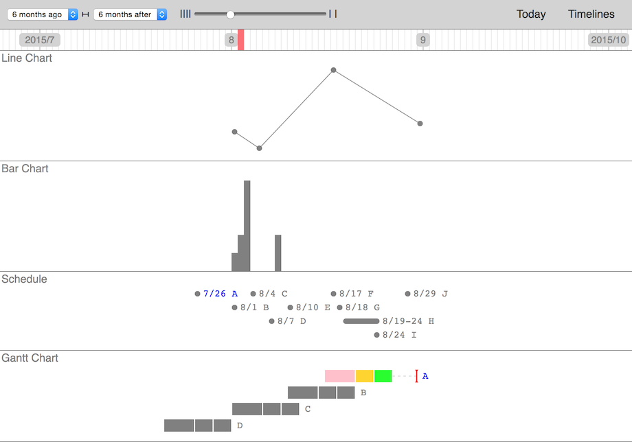

# Timeline

Web-based timeline viewer



## Features

- Display multiple timeline contents
- Change a time scale and span

## Quickstart guide

#### 1. Create a timeline data file

A timeline data file must be JSON.

The following is each type of the timeline content samples.

- Line chart

```json
{
  "title": "Line Chart",
  "type": "line-chart",
  "data": [
    {"date": "2015-08-01", "value": 500},
    {"date": "2015-08-05", "value": 100},
    {"date": "2015-08-17", "value": 2000},
    {"date": "2015-08-31", "value": 700}
  ]
}
```

- Bar chart

```json
{
  "title": "Bar Chart",
  "type": "bar-chart",
  "data": [
    {"date": "2015-08-01", "value": 100},
    {"date": "2015-08-02", "value": 200},
    {"date": "2015-08-03", "value": 500},
    {"date": "2015-08-08", "value": 200}
  ]
}
```

- Schedule

```json
{
  "title": "Schedule",
  "type": "schedule",
  "data": [
    {"date": "2015-07-26", "value": "7/26 A", "link": "#"},
    {"date": "2015-08-01", "value": "8/1 B"},
    {"date": "2015-08-04", "value": "8/4 C"},
    {"date": "2015-08-07", "value": "8/7 D"},
    {"date": "2015-08-10", "value": "8/10 E"},
    {"date": "2015-08-17", "value": "8/17 F"},
    {"date": "2015-08-18", "value": "8/18 G"},
    {"date": "2015-08-19", "duration": 6, "value": "8/19-24 H"},
    {"date": "2015-08-24", "value": "8/24 I"},
    {"date": "2015-08-29", "value": "8/29 J"}
  ]
}
```

- Gantt chart

```json
{
  "title": "Gantt Chart",
  "type": "gantt-chart",
  "data": [
    {
      "data": [
        {"date": "2015-08-16", "duration": 5, "value": "a", "color": "pink"},
        {"date": "2015-08-21", "duration": 3, "value": "b", "color": "gold"},
        {"date": "2015-08-24", "duration": 3, "value": "c", "color": "lime"}
      ],
      "deadline": "2015-08-30",
      "value": "A",
      "link": "#"
    },
    {
      "data": [
        {"date": "2015-08-10", "duration": 5, "value": "a"},
        {"date": "2015-08-15", "duration": 3, "value": "b"},
        {"date": "2015-08-18", "duration": 3, "value": "c"}
      ],
      "value": "B"
    },
    {
      "data": [
        {"date": "2015-08-01", "duration": 5, "value": "a"},
        {"date": "2015-08-06", "duration": 3, "value": "b"},
        {"date": "2015-08-09", "duration": 3, "value": "c"}
      ],
      "value": "C"
    },
    {
      "data": [
        {"date": "2015-07-21", "duration": 5, "value": "a"},
        {"date": "2015-07-26", "duration": 3, "value": "b"},
        {"date": "2015-07-29", "duration": 3, "value": "c"}
      ],
      "value": "D"
    }
  ]
}
```

#### 2. Edit _settings.json_

Add the url of the timeline data file into the "timelines" member.

#### 3. Open _index.html_ in a browser

Set the visibility of each timeline in the header menu. ("Timelines" -> "Select")

## Running locally

- Install [Node](https://nodejs.org/download/)
- Install the dependencies

```
npm install
```

Then run:

```
npm start
```

Works on IE10+, Firefox, Safari, Chrome.

## License

Copyright &copy; 2015 iOnStage
Licensed under the [MIT License][mit].

[MIT]: http://www.opensource.org/licenses/mit-license.php